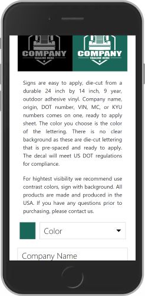
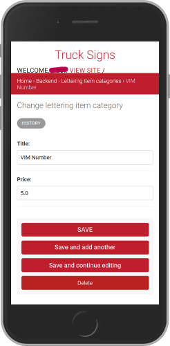
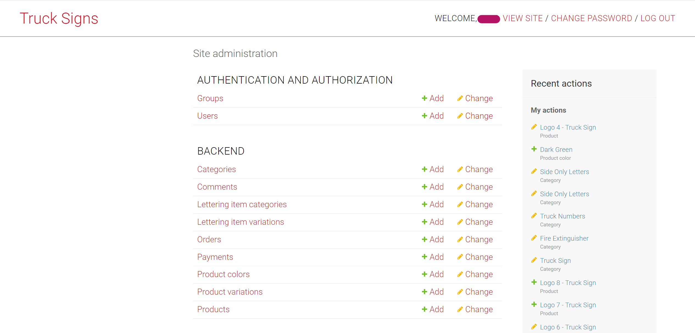

<div align="center">


# Signs for Trucks

     


</div>


## Table of Contents

1. [Description](#introduction)
1. [Install (Run) with Docker](#docker)
1. [Installation without Docker](#installation)
1. [Connect to the Django Backend API](#connect_backend)
1. [Screenshots of the Frontend Next js App](#screenshots_frontend)
1. [Screenshots of the Django Backend Admin Panel](#screenshots)
1. [Screenshots of the Original Frontend Design](#screenshots_original)

<a name="introduction"></a>
## Description
__Signs for Trucks__ is an online store to buy pre-designed vinyls with custom lines of letters (often call truck letterings). The store also allows clients to upload their own designs and to customize them on the website as well. Aside from the vinyls that are the main product of the store, clients can also purchase simple lettering vinyls with no truck logo, a fire extinguisher vinyl, and/or a vinyl with only the truck unit number (or another number selected by the client).

### Services Explained

1. __Selecting a pre-designed vinyl or uploading one:__ In the principal view of the website the client can select one of the pre-designed vinyls available to edit, or the client can upload a png, jpg, ... photo to use as the template for the vinyl. After this the client is redirected to the edit-vinyl section.

2. __Editing the selected/uploaded vinyl:__ In this page the client selects what lines of lettering should be added to the selected/uploaded vinyl as well as the color of the lettering (note that the background of the vinyl will be the color of the physical truck). The client can also leave a comment about more specific/custom instructions, and should always provide an email to contact or send a pre-view of the product. After this the client is redirected to the make-payment section.

3. __Making a Payment:__ The payment is managed via [Stripe](https://stripe.com/). The client should provide the required information that will be processed in the backend (DJANGO API). Then, the vinyl is sent to production.

<a name="docker"></a>
## Install (Run) with Docker

1. Clone the repo:

   ```bash
   git clone https://github.com/lionking0105/truck_signs_frontend.git
   ```

1. Install Docker and Docker Compose

1. Configure the environment variables: Create an .env.local file inside the root folder and set up the following environment variables:

   ```text
    NEXT_PUBLIC_API_DOMAIN_NAME (The url of the backend, for example, https://backend_api.com/)
   ```

1. Run the command:

   ```bash
   docker-compose up --build
   ```

1. Congratulations =) !!! the app should be running in [localhost:3000](http://localhost:3000)


<a name="installation"></a>

## Installation without Docker

1. Clone the repo:

   ```bash
   git clone https://github.com/lionking0105/truck_signs_frontend.git
   ```

1. Install dependencies:
   ```bash
   npm install
   ```

1. Configure the environment variables: Create an .env.local file inside the root folder and set up the following environment variables:

   ```text
    NEXT_PUBLIC_API_DOMAIN_NAME (The url of the backend, for example, https://backend_api.com/)
   ```

1. Run the app

   ```bash
   npx next dev
   ```

1. Congratulations =) !!! the app should be running in [localhost:3000](http://localhost:3000)


<a name="connect_backend"></a>
## Run with the Django Backend (with and without Docker)

__Note:__ Before following these steps clone this repository. From now on the selected folder that contains the clone will be referred as __project_root__. So far, it should look like this:
   ```sh
      project_root
      └── truck_signs_frontend
   ```

1. Assuming that your are at the __project_root__, clone the [Django Backend API repository](https://github.com/lionking0105/truck_signs_api):
   ```sh
      git clone https://github.com/lionking0105/truck_signs_api.git
   ```
   Now the __project_root__ folder should look like:
      ```sh
      project_root
      ├── truck_signs_frontend
      └── truck_signs_api
   ```

- ### If Using Docker and Docker Compose
   1. Copy the content of the docker-compose-connect.yml to a new file docker-compose.yml in the __project_root__. The docker-compose-connect.yml file can be found at the root of this repository and also at the root of the [Django Backend API repository](https://github.com/lionking0105/truck_signs_api) (Either file is fine to copy).
   1. Follow the instruction to configure the environment variables of the __Django__ backend API that can be found in the section __Install (Run) with Docker__ in the Readme.md of the [Django Backend API repository](https://github.com/lionking0105/truck_signs_api)
   1. Follow the instructions on the __Install (Run) with Docker__ section of this Readme.md to configure the environment variables for this repo. The only env variable needed is the Flask Backend url, which by default should be [http://localhost:80](http://localhost:80).
   __Note:__ Right now the __project_root__ should look like:
         ```sh
         project_root
         ├── truck_signs_frontend
         ├── truck_signs_api
         └── docker-compose.yml
      ```

   1. Run the command:

      ```bash
      docker-compose up --build
      ```

   1. Congratulations =) !!! the frontend app should be running in [localhost:3000](http://localhost:3000) while the backend is at [localhost:80](http://localhost:80)

   1. (Optional step) To create a super user run:
   ```bash
      docker-compose run api ./manage.py createsuperuser
   ```

__NOTE:__ To create Truck vinyls with Truck logos in them, first create the __Category__ Truck Sign, and then the __Product__ (can have any name). This is to make sure the frontend retrieves the Truck vinyls for display in the Product Grid as it only fetches the products of the category Truck Sign.


- ### Running without Docker and Docker Compose
   1. Follow the instructions of the __Installation without Docker__ section in the Readme.md of the [Django Backend API repository](https://github.com/lionking0105/truck_signs_api) to configure and run the backend.
   1. Follow the instructions of section __Installation without Docker__ of this Readme.md. Modify the NEXT_PUBLIC_API_DOMAIN_NAME to be the url of the __Django__ Backend API (by default it is [http://localhost:8000](http://localhost:8000)).
   1. Congratulations =) !!! the frontend app should be running in [localhost:3000](http://localhost:3000) while the backend is at [localhost:8000](http://localhost:8000)


__NOTE:__ To create Truck vinyls with Truck logos in them, first create the __Category__ Truck Sign, and then the __Product__ (can have any name). This is to make sure the frontend retrieves the Truck vinyls for display in the Product Grid as it only fetches the products of the category Truck Sign.

---


<a name="screenshots_frontend"></a>

### Screenshots of the Frontend NEXT JS App

#### Mobile View

<div align="center">

  

</div>

<div align="center">

  

</div>

---
#### Desktop View


---


---


---

<a name="screenshots"></a>

### Screenshots of the Django Backend Admin Panel

#### Mobile View

<div align="center">

   

</div>

---

#### Desktop View



---


---


---

<a name="screenshots_original"></a>

### Screenshots of the Original Frontend Design

__NOTE:__ Some of the components of the original design have been changed, such as banner images, logos, fonts, and color tones. The main difference from the original design and the final result is footer that was extended to show more information, aside from this change there should not by any other major difference between the original design and the final result.


